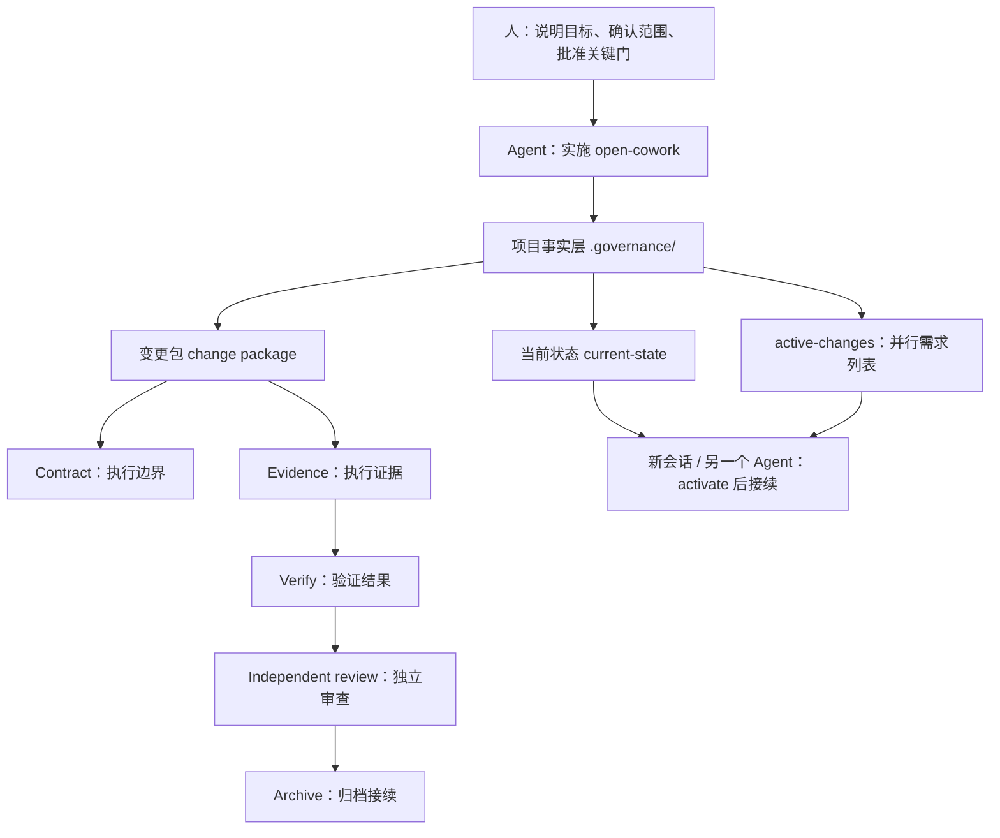

# open-cowork

`open-cowork` 是一个 Agent-first collaboration governance protocol。它把复杂项目里的意图、范围、角色、证据、审查、归档和接续状态落成项目事实，让不同 AI Coding 环境和本地个人域 Agent 可以围绕同一个项目继续工作。

它的默认入口不是让人学习一套命令行，而是让人把目标讲给 Agent。**CLI 是 Agent 内部工具**，用于维护结构化事实、排障和接力。

## 人只需要对 Agent 说

```text
安装 open-cowork，并在当前项目中实施这套协同治理框架。
```

或者：

```text
请用 open-cowork 管理当前项目接下来的开发任务。
```

如果这个项目已经实施过 open-cowork，人不需要知道内部文件怎么读，只需要告诉新会话或另一个 Agent：

```text
这个项目已经实施 open-cowork，请按项目里的 open-cowork 接手规则接续当前需求。
```

如果同一个项目里有多个并行需求，可以说：

```text
请先列出这个项目当前正在进行的 open-cowork 需求，我选择后再接续。
```

Agent 会在内部做项目激活、读取项目事实、确认要接续的 change，然后继续当前步骤。open-cowork 的应用对象是项目，不是某个单独 Agent。

## 典型使用场景

### 个人域单一 Agent 系统

一个人只使用 Codex、Claude Code 或其他单一 AI Coding 环境时，open-cowork 主要解决“长任务不断线”的问题。Agent 把本轮需求、范围、执行证据、验证结果和下一步接续状态写入项目里的 `.governance/`，即使会话压缩、重开窗口或隔天继续，也可以从项目事实恢复，而不是靠聊天记录回忆。

### 本地个人域多个 Agent 系统调度协同

一个人同时使用 Codex、Claude Code、Hermes、OMOC / OpenCode 等多个本地 Agent 时，open-cowork 主要解决“同一项目、多个 Agent 不互相猜状态”的问题。不同 Agent 进入项目后都先读取项目级 activation 和 `.governance/agent-entry.md`，再围绕同一个 active change、contract、bindings 和 evidence 协作。需求 1 和需求 2 可以同时存在于 active changes 列表中，但接手时必须显式选择要继续哪个 change。

### 团队多人域场景

多人团队中，每个人可以有自己的个人域 Agent 和熟悉的 AI Coding 环境。open-cowork 不要求团队统一 runtime 或工作台，而是在项目层提供共同事实面：谁负责、当前范围是什么、何时允许执行、证据在哪里、谁做独立审查、是否可以归档。这样每个“超级个体”可以保持自己的工具组合，同时通过项目级 contract、evidence、review 和 archive 形成可持续协作的“超级组织”。

## 项目级接手规则（Skill）怎么用

open-cowork 会在已实施项目中生成 `.governance/agent-entry.md`。它放在 `.governance/` 下，是因为它属于“这个项目的协作事实和接手规则”，需要跟项目一起走；它不是某个 Agent 平台专属的安装型 Skill，也不是给人背命令的教程。

如果某个 Agent 环境支持自定义 Skill，可以把这份文件注册进去；如果不支持，Agent 直接把它当成项目内接手说明读取即可。

使用场景：

- 新会话接续：让当前 Agent 按项目接手规则恢复进度。
- 跨 Agent 接续：从 Codex 切到 Claude Code、Hermes、OMOC 或其他 Agent 时，让新 Agent 按同一份接手规则读取项目事实。
- 并行需求选择：当同一项目有多个正在进行的需求，让 Agent 先列出可接续项，再由人选择。
- 团队成员接入：团队成员在自己的个人域 Agent 中打开项目后，使用同一份接手规则遵守相同流程和边界。

你可以这样对 Agent 说：

```text
这个项目已经实施 open-cowork，请按项目里的 open-cowork 接手规则接续当前需求。
```

或：

```text
请先列出这个项目当前正在进行的 open-cowork 需求，我选择后再接续需求 2。
```

## 一张图



## 9 个步骤的清晰名称

| Step | 名称 | 人需要关心什么 |
| --- | --- | --- |
| 1 | 明确意图 / Clarify intent | 目标、背景、输入是否说清楚。 |
| 2 | 确定范围 / Lock scope | 要做什么、不做什么、验收标准是什么。 |
| 3 | 方案设计 / Shape approach | 方案方向、风险和取舍是否可接受。 |
| 4 | 组装变更包 / Assemble change package | Agent 把需求、方案、任务和边界装进同一个工作单元。 |
| 5 | 批准开工 / Approve execution | 人批准进入真实执行。 |
| 6 | 执行变更 / Execute change | Agent 在 contract 范围内工作并记录 evidence。 |
| 7 | 验证结果 / Verify result | 测试、检查和一致性验证。 |
| 8 | 独立审查 / Independent review | 非执行者给出 approve / revise / reject。 |
| 9 | 归档接续 / Archive and handoff | 归档、收束、生成下一轮接续状态。 |

## 核心能力

open-cowork 的 README 只说明当前框架和流程，不承担版本发布说明。具体版本变化请看 `CHANGELOG.md` 和 GitHub Release。

- 项目事实层：把意图、范围、角色、证据、审查、归档和接续状态落到 `.governance/`。
- 9 步协作主链：从明确意图到归档接续，区分人类决策、Agent 执行、验证和独立审查。
- 项目级接续：新会话、另一个 Agent 或另一个团队成员都从项目事实继续，而不是从聊天历史猜状态。
- 并行需求管理：同一项目可以同时存在多个正在推进的 change，接手时先选择要继续的需求。
- 执行边界：通过 contract 明确允许范围、禁止动作、验证要求和证据要求。
- 证据与审查：执行结果、测试输出、review decision 和 human gate 都可追溯。
- 低侵入协同：不强制统一 IDE、Agent runtime、工作台或团队成员的个人域工具组合。

## 核心概念

- `change` / 变更包：一轮可执行、可验证、可归档的工作单元。
- `contract` / 执行边界：说明目标、范围、允许动作、禁止动作、验证方式和证据要求。
- `bindings` / 角色绑定：说明每一步由谁负责、谁协助、谁审查、哪些步骤需要人确认。
- `evidence` / 证据：执行输出、测试结果、修改摘要和其他可审查材料。
- `review` / 独立审查：非执行者给出 approve / revise / reject。
- `archive` / 归档接续：收束本轮工作，留下下一轮可恢复的状态。

## `.governance/` 里放什么

`.governance/` 是目标项目里的协作事实层，不是普通文档目录，也不是所有过程材料的堆放处。它主要保存 Agent 执行与团队审计需要共享的事实：

| 内容 | 典型位置 | 主要消费者 |
| --- | --- | --- |
| Agent 接手入口 | `.governance/AGENTS.md`、`.governance/agent-entry.md` | Agent |
| 当前状态摘要 | `.governance/local/current-state.md` | 人 + Agent |
| 项目索引 | `.governance/index/*.yaml` | Agent |
| 当前变更包 | `.governance/changes/<change-id>/` | Agent + Reviewer |
| 执行边界与角色绑定 | `contract.yaml`、`bindings.yaml` | Agent + 人 |
| 阶段报告 | `step-reports/*.md` | 人 + 团队 |
| 执行证据与验证 | `evidence/**`、`verify.yaml`、`review.yaml` | Agent + Reviewer |
| 归档与接续 | `.governance/archive/<change-id>/` | Agent + 审计 |
| 临时运行投影 | `.governance/local/runtime/**`、`PROJECT_ACTIVATION.yaml` | Agent |

人和团队通常只需要读 `current-state.md`、当前 step report、review 摘要和 archive closeout；Agent 才需要消费 YAML 索引、contract、bindings、evidence 和 runtime 投影。

## 人类最小操作面

普通使用者只需要做四类决策：

1. 确认意图和范围。
2. 批准是否进入执行。
3. 选择 review 结论。
4. 批准归档或要求继续修订。

Agent 负责运行内部命令、维护 `.governance/`、汇报当前步骤、owner、阻断、下一步和需要人决定的事项。人类不需要学习 CLI；只有安装或排障时才需要让 Agent 展示少量备用命令。

## 文档入口

- `AGENTS.md`：给 Agent 的仓库级入口，强调不要把人带回 CLI-first。
- `docs/README.md`：文档地图，说明普通读者、Agent、规格读者和历史追溯者各看哪里。
- `docs/glossary.md`：术语表。
- `docs/getting-started.md`：上手细节和备用路径。
- `docs/agent-skill.md`：说明项目级 Agent Entry 与平台 Skill 适配关系。
- `docs/agent-playbook.md`：Agent 实施 open-cowork 时的操作规则。
- `docs/specs/`：当前有效协议规格。
- `docs/archive/`：历史证据，不是当前实施入口。

## 一句话总结

`open-cowork` 的价值不是让人多背一套流程，而是让多个 Agent 和多个 AI Coding 环境在同一个项目里，按同一套可验证事实协作和接续。
