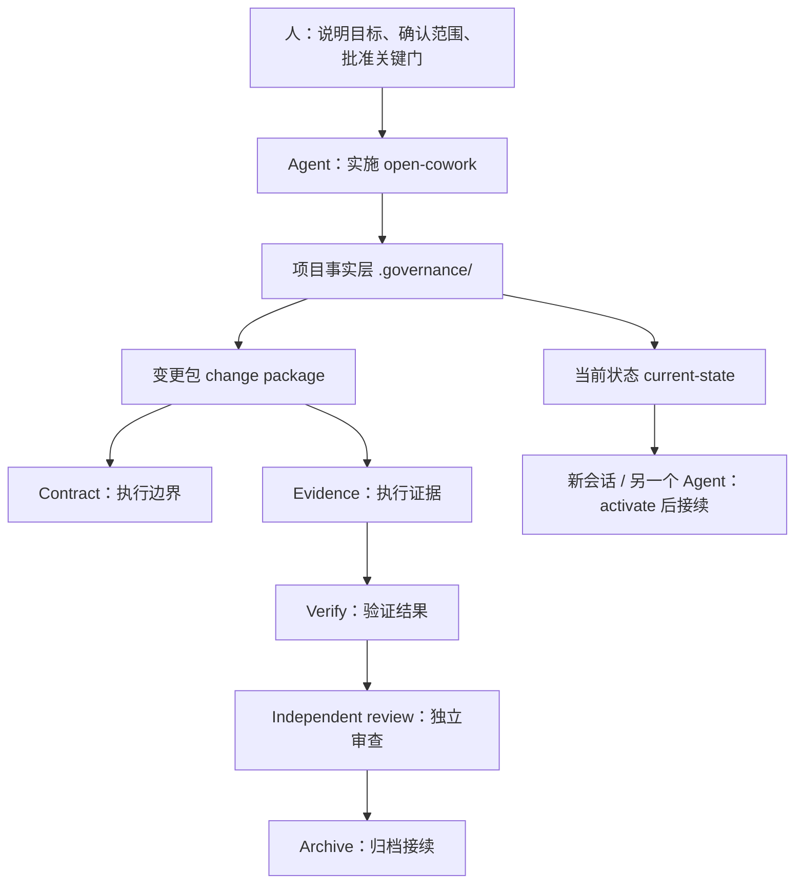

# open-cowork

`open-cowork` 是一个 Agent-first collaboration governance protocol。它把复杂项目里的意图、范围、角色、证据、审查、归档和接续状态落成项目事实，让不同 AI Coding 环境和本地个人域 Agent 可以围绕同一个项目继续工作。

它的默认入口不是让人学习一套命令行，而是让人把目标讲给 Agent。**CLI 是 Agent 内部工具**，用于维护结构化事实、排障和接力。

## 人只需要对 Agent 说

```text
安装 open-cowork，并在当前项目中实施这套协同治理框架。
```

或者：

```text
请用 open-cowork 管理当前项目接下来的开发任务。
```

如果这个项目已经实施过 open-cowork，新会话或另一个 Agent 应先运行项目激活检查：

```bash
ocw activate
```

然后读取项目里的 `.governance/AGENTS.md`、`.governance/current-state.md` 和当前 change 的 contract / bindings / step report，继续当前步骤。open-cowork 的应用对象是项目，不是某个单独 Agent。

## 一张图



## 9 个步骤的清晰名称

| Step | 名称 | 人需要关心什么 |
| --- | --- | --- |
| 1 | 明确意图 / Clarify intent | 目标、背景、输入是否说清楚。 |
| 2 | 确定范围 / Lock scope | 要做什么、不做什么、验收标准是什么。 |
| 3 | 方案设计 / Shape approach | 方案方向、风险和取舍是否可接受。 |
| 4 | 组装变更包 / Assemble change package | Agent 把需求、方案、任务和边界装进同一个工作单元。 |
| 5 | 批准开工 / Approve execution | 人批准进入真实执行。 |
| 6 | 执行变更 / Execute change | Agent 在 contract 范围内工作并记录 evidence。 |
| 7 | 验证结果 / Verify result | 测试、检查和一致性验证。 |
| 8 | 独立审查 / Independent review | 非执行者给出 approve / revise / reject。 |
| 9 | 归档接续 / Archive and handoff | 归档、收束、生成下一轮接续状态。 |

## 当前版本

当前 `v0.3.4` 是 “Human Onboarding and Project Activation”。它在 v0.3.3 strict gates 的基础上，解决真实试用里的心智负担问题：

- Step 名称改为人能直接理解的动作名。
- 新增项目级 activation，让 Codex、Claude Code、Hermes、OMOC 或新会话都从同一项目事实接续。
- README 只保留人类入口、流程图和最小理解面。
- `docs/README.md` 明确普通读者、Agent 执行者、规格读者和历史追溯者分别看哪里。
- `docs/glossary.md` 解释 Contract、Evidence、Bindings、Continuity、变更包、Gate、Closeout、Increment、Digest 等常见概念。

v0.3.3 已经具备 strict single-step gate、可选 sponsor-held approval token、decision-grade Step report、review/rework lifecycle、scope overlap 产品化恢复建议和 Step 9 closeout report。

## 人类最小操作面

普通使用者只需要做四类决策：

1. 确认意图和范围。
2. 批准是否进入执行。
3. 选择 review 结论。
4. 批准归档或要求继续修订。

Agent 负责运行内部命令、维护 `.governance/`、汇报当前步骤、owner、阻断、下一步和需要人决定的事项。

Shell 备用路径只用于安装、排障或帮助 Agent 定位工具：

```bash
./scripts/bootstrap.sh
ocw version
```

## 文档入口

- `AGENTS.md`：给 Agent 的仓库级入口，强调不要把人带回 CLI-first。
- `docs/README.md`：文档地图，说明普通读者、Agent、规格读者和历史追溯者各看哪里。
- `docs/glossary.md`：术语表。
- `docs/getting-started.md`：上手细节和备用路径。
- `docs/agent-playbook.md`：Agent 实施 open-cowork 时的操作规则。
- `docs/specs/`：当前有效协议规格。
- `docs/archive/`：历史证据，不是当前实施入口。

## 一句话总结

`open-cowork` 的价值不是让人多背一套流程，而是让多个 Agent 和多个 AI Coding 环境在同一个项目里，按同一套可验证事实协作和接续。
